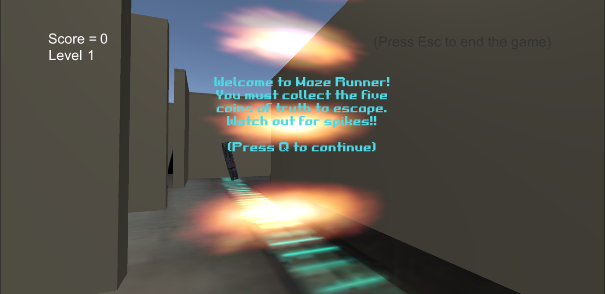
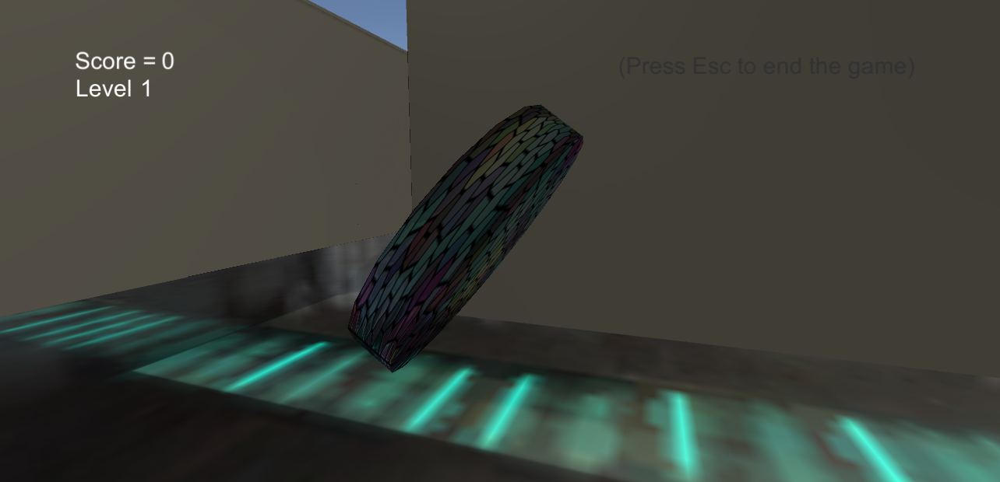
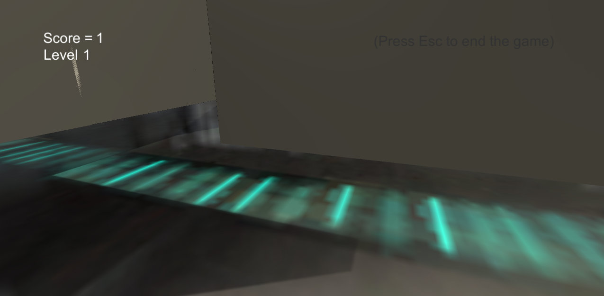
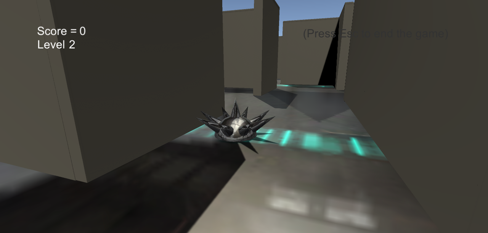
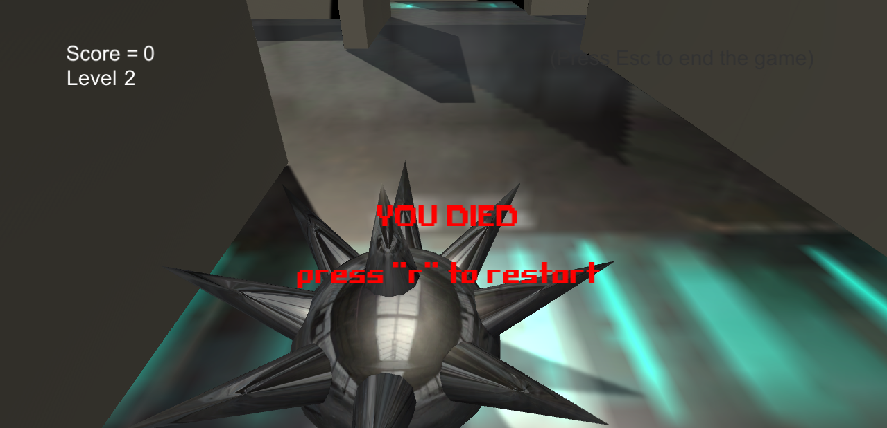
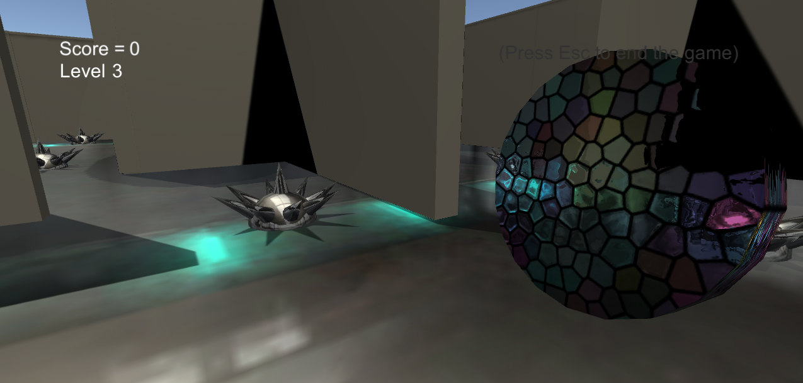
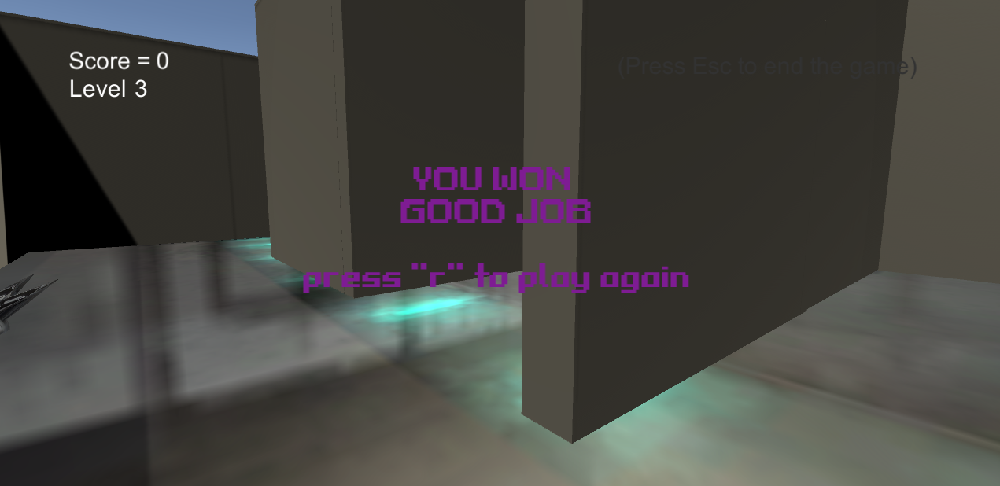

# Welcome to MazeRunner
 
You have to collect the coins of truth in order to progress throughout the levels. You are first greeted with an impassable door that can only be removed by pressing "q". 

Once pressed, you are allowed to explore the map and start collecting coins. The counter goes up the more you collect. 

In this test run through, collecting 2 coins is sufficient to go to the next level.
Each level increases with difficulty. Now there is a spike which is a hazard that can end the game if walked into.

After completing the second level, you go the third level which is the hardest out of the three.
It's a bigger maze with way more spikes.

After completing every level you win!

